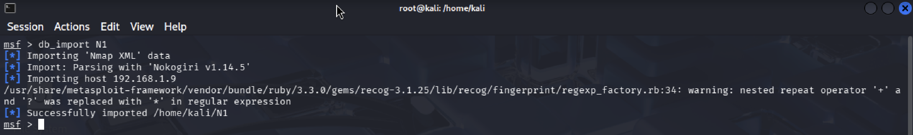
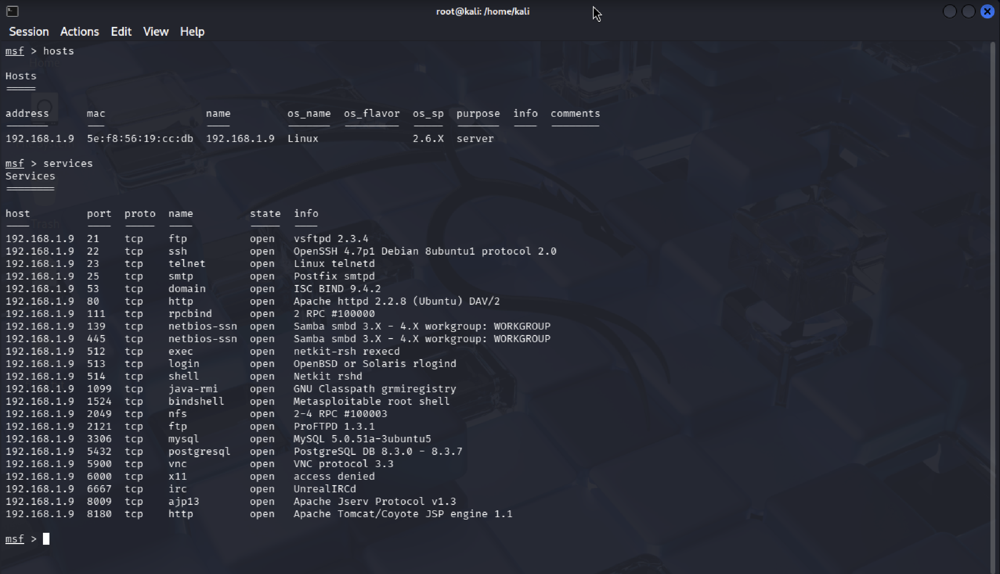
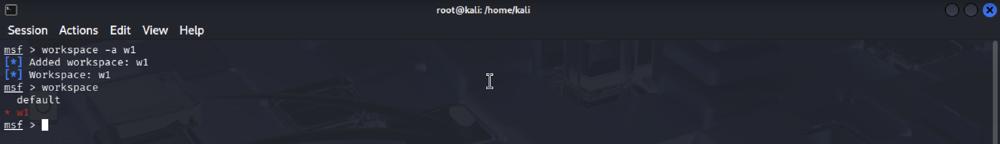
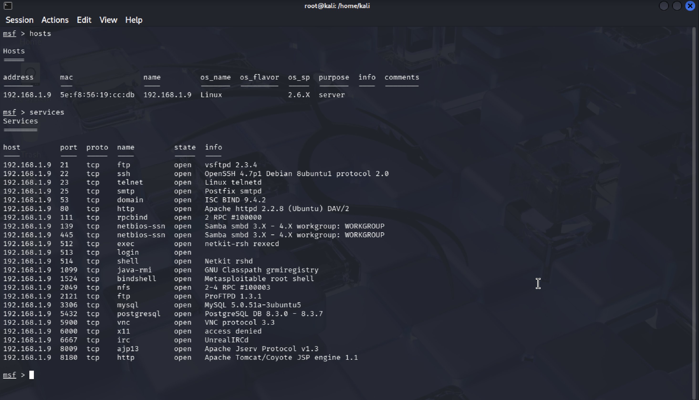

Two Types of Port Scanning

Type A

1. Scan outside msf then save it as an XML file
   
    

2. Enter msfconsole and import with db_import

    

3. Check hosts and services

    

Type B

1. Enter msf then create another workspace

    

2. Scan inside msf

    

3. Check hosts and services

    

## 📝 Notes
> Type A is good for documentation because the scan file is saved.
> Type B is better for practice or exploitation since no scan file is stored.
